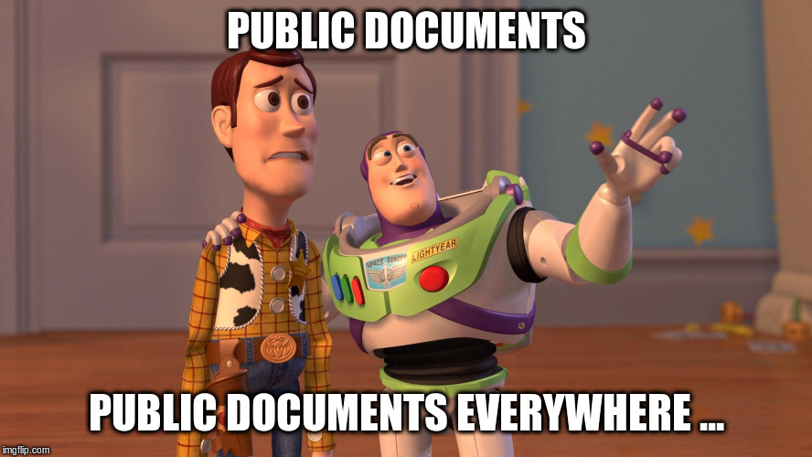

layout: true
  

`r paste0("
", params$event, " 

")` 

---

class: center, middle

Ces slides en ligne : `r paste0("http://datactivist.coop/", params$slug)`

Sources : `r paste0("https://github.com/datactivist/", params$slug)`

Les productions de Datactivist sont librement réutilisables selon les termes de la licence [Creative Commons 4.0 BY-SA](https://creativecommons.org/licenses/by-sa/4.0/legalcode.fr).

 
 

---

## Who are we ?

    

### We .red[open data], we make them .red[useful]

---

class: inverse, center, middle

## Sorry, we're buzzy chasing those sources !

---
class: inverse, center, middle

# Thank you !

Contact : [sylvain@datactivist.coop](mailto:sylvain@datactivist.coop) & [mathieu@datactivist.coop](mailto:mathieu@datactivist.coop)

