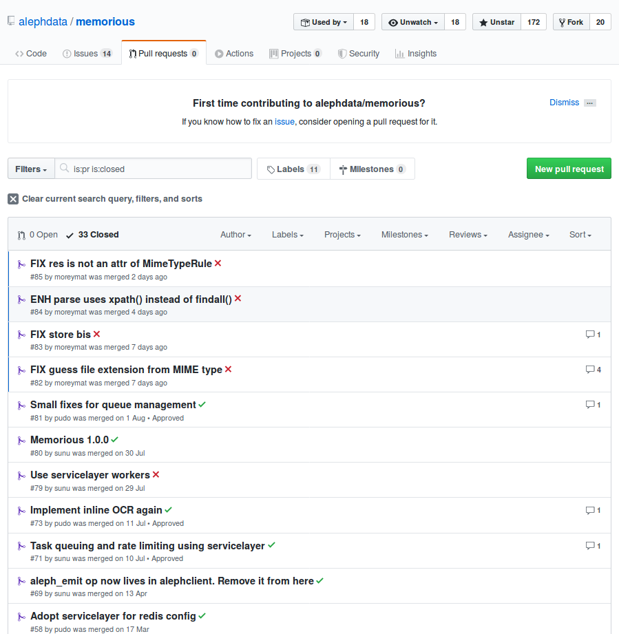
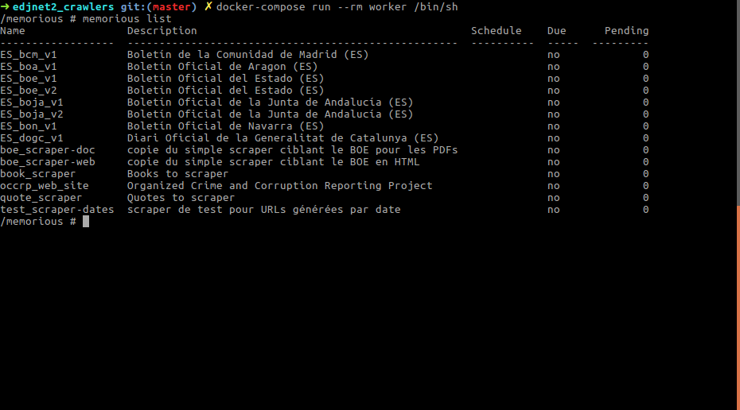
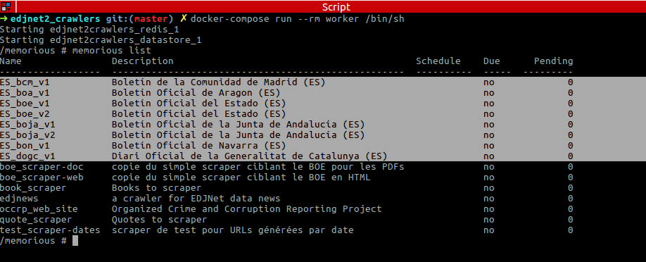
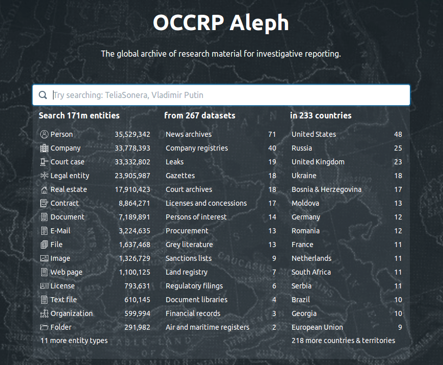

layout: true
  

`r paste0("<div class='my-footer'><span>", params$event, "</span> <center><div class=logo></center></span></div>")` 

---

class: center, middle

This presentation is available online : `r paste0("http://datactivist.coop/", params$slug)`

Sources : `r paste0("https://github.com/datactivist/", params$slug)`


Datactivist productions can be reused under the terms of [Creative Commons 4.0 BY-SA](https://creativecommons.org/licenses/by-sa/4.0/legalcode.fr) licence.

<BR>
<BR>


---

## Who are we ?

<BR><BR><BR><BR>

[](https://datactivist.coop)

### We .red[open data], we make them .red[useful]

---

class: inverse, center, middle

## I. Aleph toolkit
## our technical stack


---

## Aleph

> *Truth cannot penetrate a closed mind. If all places in the universe are in the Aleph, then all stars, all lamps, all sources of light are in it, too.* — **The Aleph**, Jorge Luis Borges

--

[Aleph](https://github.com/alephdata/aleph) is a tool for indexing, scraping and browsing large amounts of structured and unstructured data sources. It is entirely open-source.

The tool is used and maintained by several organisations dedicated to investigating corruption and organized crime across the globe, such as Code for Africa and OpenOil, to the benefit of many medias.

Our interest in Aleph lies in three main features :
* **scraping** (via OCR and advanced parsing) ;
* **indexation** (for browsing, including front-end);
* **entity mapping** (identification and connection of named entities accross documents).

---

## Memorious

> *The solitary and lucid spectator of a multiform, instantaneous and almost intolerably precise world.* — **Funes the Memorious**, Jorge Luis Borges

--

[Memorious](https://github.com/alephdata/memorious) is the module of the Aleph toolkit dedicated to crawling and scraping documents.

It works as a framework. Meaning it handles several smaller programs to execute several tasks.

Our interest in Memorious is three-fold :
* it allows us to **crawl** a large number of websites ;
* it can integrate **custom crawlers** and also **processing scripts** to extract and structure data from various sources and formats ;
* it works in sync with Aleph, allowing **regular and automated updates of our databases**.

---

.center[
## The "search4eu" set-up
]

.pull-left[
.center[

#### BACK

#### .red[Memorious]
crawls sites, cleans & stores data

`r emo::ji('arrow_down')`

#### .red[Aleph]
indexes docs & extracts entities

_________

#### FRONT

*search4eu, a custom search-engine*
]
]

.pull-right[
Our work consists in configuring, coordinating and, if necessary, completing both Aleph and Memorious to create custom search engines designed specifically for the topics covered.

In practice :
1. we set up crawlers in Memorious to target the websites that may publish relevant documents ;
2. we store the results to feed them to Aleph ;
3. we configure Aleph to index documents & map entities to make them accessible in a seach-engine interface.
]

---

### Open-source innovation

.pull-left[
Aleph framework is an entirely open-source framework developped, maintained and improved by a large community of various organizations :
* Organized Crime and Corruption Reporting Project ([OCCRP](https://www.occrp.org/en)) ;
* die Süddeutsche Zeitung ;
* der Dagbladet Medialab ;
* many other media and NGOs.

We help identify problems and new needs and to address them. All those fixes and new features are integrated to the project.

]

.pull-right[
Datactivist's team already made several contributions to the Aleph framework, to improve document identification and crawling capabilities.

.center[

]
]
---

class: inverse, center, middle

## Sorry, we're buzzy chasing those sources !


---

background-image: url(https://media.giphy.com/media/l41JTBkBhk42oAniE/giphy.gif)
class: center, top, inverse

## II. Memorious, our crawling framework


---

### General mecanics

**Memorious** is the first module we need : it's a program used to retrieve docs and data from open sources on the Internet. It allows us to handle fleets of **crawlers**.

**Crawlers** are short programs that target specifics websites, pages, documents and data by combining **methods** into a straight order called *"the pipeline"*.

**Methods** are shorter programs that perform specific tasks required to crawl : generating numbers, pasting data into a URL, fetch HTML from a web page, storing data, etc.

--

So, we use programs inside programs inside a program.

---

background-image: url(https://media.giphy.com/media/7eDwGToebGh2w/giphy.gif)
class: center, top, inverse


## It's not Inception* : it's a framework.

--

.footnote[\* and this is not Inception either, this is Shutter Island.]

---

### The crawlers : our blueprints

**Crawlers** perform tasks in a specifics order, passing the result of each operation to a subsequent one. This series of **steps** is called **the pipeline** .

--

.pull-left[
It usually goes like this :
1. we generate building parts for the URL (dates, numbers, etc.) (*init*) ;
2. we paste them into a URL (*seed*) ;
3. we retrieve the HTML (*fetch*) ;
4. we look it up for document's addresses (*parse*) ;
5. we download the docs (*store*).

At each step, we call for one **method** (we'll see that in a minute). At the end of every step, we `pass` the result of the operation.
]

.pull-right[
The crawler themselves are configured via a YAML file that goes something like this :

```yaml
name: my_crawler
pipeline:
  init:
    method: xxx
    ...
    handle: 
      pass: seed
  seed:
    method: yyy
    ...
    handle: 
      pass: fetch
  fetch:
    method: zzz
    ...

```

]

---

### The methods : our toolbox

The **methods** are Python scripts designed to perform the tasks necessary to scraping. Every method has a designated spot in the pipeline : it can only treat specific data input and output a specific data format. Methods often require **parameters** (called here "*params*") to specify the way to handle a task : starting number for enumeration, base URL to seed, target xPath to parse HTML, etc.

```python
def seed(context, data):
    """Initialize a crawler with a set of seed URLs.

    The URLs are given as a list or single value to the ``urls`` parameter.

    If this is called as a second stage in a crawler, the URL will be formatted
    against the supplied ``data`` values, e.g.:

        https://crawl.site/entries/%(number)s.html
    """
    for key in ('url', 'urls'):
        for url in ensure_list(context.params.get(key)):
            url = url % data
            context.emit(data={'url': url})
```


---

### Memorious at work



???

First example : edjnews, a crawler for EDJNet data news
1. the interface ;
2. running the crawler ;
3. processing the queue [it can run several crawlers simultaneously ; it can schedule]

---

### What do we get ?

The crawler basic goal it to retrieve documents and to store data about them.

#### 1. The doc itself

The doc itself is downloaded from the specified path specified in the crawler.

Although it is slightly modified to be digested :

--

* it is renamed with a "hash" : as document name format is not standard and naming metadata sometime badly coded, Memorious standardises doc names into a 41 long character non-sense like :
  * b7adab39f94b8f77fefec2c739d8c6cf46e6f71f ;
  * 12f9675127da07ff3c8f837254971bcf89b35b5f ;
  * 7d6d010a1dbd663e0600583e69cb686d465a58d5 (this is my favorite).
* the format is standardised to ".raw" for handling.

However, the content of the file reamins intact and it can be displayed easily to check.

???

Show raw file from the edjnews operation.

---

#### 2. A json file

It's named the same way as the doc it refers to. It contains data about the doc (type, address, encoding ...), the operation performed by the crawler (request, timestamp, etc.) and, optionaly, extra metadata, if configured accordingly. Those data can be used and accessed directly and by Aleph after transfer.

> {"url": "http://www.boa.aragon.es/cgi-bin/EBOA/BRSCGI?BASE=BOLE&CMD=VERLST&DOCS=1-200&PUBL=20190805&SEC=FIRMA", "request_id": "GET http://www.boa.aragon.es/cgi-bin/EBOA/BRSCGI?BASE=BOLE&CMD=VERLST&DOCS=1-200&PUBL=20190805&SEC=FIRMA", "status_code": 200, "content_hash": "691e5a5bc76485f1236c9ad62ff7e63cbbe034f5", "headers": {"Date": "Tue, 17 Sep 2019 12:52:20 GMT", "Server": "Apache", "Set-Cookie": "BCSID=a015cb6b; path=/", "Connection": "close", "Transfer-Encoding": "chunked", "Content-Type": "text/html"}, "retrieved_at": "2019-09-17T12:52:21.054501", "title": "Bolet\u00edn Oficial de Arag\u00f3n", "_file_name": "691e5a5bc76485f1236c9ad62ff7e63cbbe034f5.raw"}

???

Show json file from edjnews operation.

---

### How do we proceed for search4eu ? 

Our main goal with Memorious regarding **search4eu** was to create fleats of crawlers able to retrieve large amounts of legal decisions in several countries and filter them according to the topic of the investigations.

--

.pull-left[
.center[**.red[Method]** `r emo::ji('hammer_and_pick')`]

1. study websites for patterns ;
2. test pattern with devtools ;
3. design a general pipeline to get every decision ;
4. test the "generic crawlers" until working ;
5. study websites to search filtering patterns ;
6. embed the filtering method in generic crawler ;
7. repeat until Berlin.
]

.pull-right[
.center[**.red[Targets]** `r emo::ji('dart')`]

Ángela provided us with a comprehensive list of websites to target that fit into several categories :
* legal decision portals (national and regional boletines) ;
* representative assemblies (Senado y Congresso) ;
* public registers (subvenciones, contrataciones, etc.).

We focused on the earlier in order to find patterns and replicables formats.
]

---

### Our *Spanish fleet*\*

We began with a fleet of six crawlers designed to retrieve every decision related to health published on legal portals accross Spain between January 1st 2000 and today. Each can download up to 10 decisions per minute.



--

.footnote[\* We will only rename it "*Spanish Armada*" if our project crashes in the Channel after the enactment of Brexit.]

???

Show them in action


---


background-image: url(https://media.giphy.com/media/l2SqfufCKFYdArZIs/giphy.gif)
class: center, top, inverse


## III. Aleph, our indexation framework


---

### General aspects

The documents and documentation (i.e. the json files) gathered by **Memorious** can be made accessible to **Aleph** in two ways :
* by storing them in a shared directory on a server (or locally) with the `store` method ;
* by connecting directly to Aleph API with the *aleph_emit* method, available in the *alephclient* package (available [on Github](https://github.com/alephdata/alephclient) and through `pip`).

--

Once *fed*, Aleph can index the document and extract information about them to make them searchable through it's front-end interface.

Apart from simple indexation, Aleph provides other entry points through the data gathered by Memorious :
* doc types ;
* countries ;
* dates ;
* etc.

---

### Browsing Aleph



---

### Our first custom search engine (beta)


---

### Other Aleph interfaces ?


---


background-image: url(https://media.giphy.com/media/3ov9jZafEefHLyTf8c/giphy.gif)
class: center, top, inverse

## IV. Coming up next

---

### Database guides

???

summaries for datasets

---

### Entity mapping

???

NPL power unleashed for cross-document entity mapping

---

class: inverse, center, middle

# Thank you !

Contact : [sylvain@datactivist.coop](mailto:sylvain@datactivist.coop) & [mathieu@datactivist.coop](mailto:mathieu@datactivist.coop)

